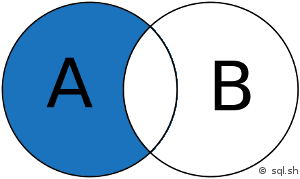

# Veille SGBD

## Système de gestion de base de données

Un système de gestion de base de données (SGBD) est le logiciel qui permet à un ordinateur de stocker, récupérer, ajouter, supprimer et modifier des données. Un SGBD gère tous les aspects primaires d'une base de données, y compris la gestion de la manipulation des données, comme l'authentification des utilisateurs, ainsi que l'insertion ou l'extraction des données.
en garantissant la qualité, la pérennité et la confidentialité des informations, tout en cachant la complexité des opérations. [1]

Un SGBD définit ce qu'on appelle le schéma de données ou la structure dans laquelle les données sont stockées.

Les outils que nous utilisons tous au quotidien nécessitent des SGBD en coulisse. Cela comprend les guichets automatiques bancaires, les systèmes de réservation de vols, les systèmes d'inventaire au détail et les catalogues de bibliothèques, par exemple. [2]

- **Qu'est-ce qu'une base de données relationnelle ?**

    Une base de données relationnelle est une base de données qui forme des relations entre des tables qui stockent des données sur des entités spécifiques. Une base de données relationnelle utilise SQL, langage de requête structuré.

- **Qu'est-ce qu'une base de données non relationnelle ?**

    Les bases de données NoSQL sont plus flexibles car les données sur l'objet ne sont pas limitées à la même table. Les bases de données non relationnelles utilisent des colonnes et des lignes pour saisir des types de données et leurs valeurs et identifier les objets avec des clés. [6]

### Forces des SGBD relationnels

* Modèle simple

* Précision des données

* Accès facile aux données

* Intégrité des données

* Flexibilité

* Normalisation

* Sécurité

* Les bases de données relationnelles sont faciles à modifier [6]

Les bases de données relationnelles permettent d’avoir des données claires et claires. Des problèmes surviennent lorsque toutes les données de l’exemple précédent ne sont contenues que dans une seule table, contrairement à une base de données relationnelle. Étant donné que chaque élève a plusieurs années d’études, leurs coordonnées seraient entrées plusieurs fois en même temps que chaque année d’études. Cela n’est pas nécessaire et peut créer de la confusion lors de la recherche dans la base de données. En les séparant, comme dans une base de données relationnelle, les informations de contact n’ont besoin d’être saisies qu’une seule fois. [7]

### Faiblesses des SGBD relationnels

* Les problèmes de performance
* Pas de prise en charge des types de données complexes
* La configuration prend beaucoup de temps au cours des étapes initiales. [6]

Le principal problème lors de l’utilisation d’une base de données relationnelle est la complexité qui apparaît lors de sa création. Il est absolument vital que les relations définies entre les tables soient correctes et que chaque ensemble d’informations soit lié à sa paire. Bien qu’il y ait moins d’informations à saisir au total qu’avec d’autres bases de données, s’assurer que chaque point est correctement configuré est un processus lent. De plus, les relations peuvent devenir extrêmement complexes lorsqu’une base de données relationnelle contient plus de deux tables. [7]

### Propriétés ACID [9]

Les propriétés ACID sont quatre propriétés essentielles d'un sous-système de traitement de transactions d'un système de gestion de base de données. Le mot **ACID** est un acronyme référant aux propriétés suivantes :

- **Atomicité** : une transaction doit soit être complètement validée ou complètement annulée.
- **Cohérence** : aucune transaction ne peut sortir de la base de données dans un état incohérent.
- **Isolation** : une transaction ne peut voir aucune autre transaction en cours d'exécution.
- **Durabilité** : après que le client ait été informé du succès de la transaction, les résultats de celle-ci ne disparaîtront pas.

------------------------------------

## Les spécificités des systèmes NoSQL

------------------------------------

## Les spécificités des systèmes NewSQL

------------------------------------

## Commandes SQL [] []

### Tri des données
(ORDER BY)

### Renommage
(AS)

### Agrégation
(GROUP BY)

### Jointures

- **INNER JOIN** : jointure interne pour retourner les enregistrements quand la condition est vrai dans les 2 tables. C'est l'une des jointures les plus communes.

- **RIGHT JOIN** : jointure croisée permettant de faire le produit cartésien de 2 tables. En d'autres mots, permet de joindre chaque lignes d'une table avec chaque lignes d’une seconde table. Attention, le nombre de résultats est en général très élevé.

- **LEFT JOIN** : jointure externe pour retourner tous les enregistrements de la table de gauche (LEFT = gauche) même si la condition n'est pas vérifié dans l'autre table.

- **FULL JOIN** : jointure externe pour retourner tous les enregistrements de la table de droite (RIGHT = droite) même si la condition n'est pas vérifié dans l'autre table.

- **SELF JOIN** : permet d’effectuer une jointure d’une table avec elle-même comme si c'était une autre table.

- **NATURAL JOIN** : jointure naturelle entre 2 tables s'il y a au moins une colonne qui porte le même nom entre les 2 tables SQL.

- **UNION JOIN** : jointure d'union.

#### Exemple d'utilisation 

``SELECT *
FROM A
INNER JOIN B ON A.key = B.key``

### Opération

------------------------------------

## Merise

Modèle conceptuel de données (MCD)

Modèle logique de données (MLD)

Modèle physique de données (MPD)

------------------------------------

# Bibliographie

* [1] : **Système de gestion de base de données** (https://fr.wikipedia.org/wiki/Syst%C3%A8me_de_gestion_de_base_de_donn%C3%A9es).
* [2] : **L'essentiel à savoir un système de base de données** (https://www.oracle.com/fr/database/systeme-gestion-base-de-donnees-sgbd-definition.html).
* [3] : **Base de données relationnelle** (https://fr.wikipedia.org/wiki/Base_de_donn%C3%A9es_relationnelle).
* [4] : **Introduction aux SGBD relationnels** (https://cours.ebsi.umontreal.ca/sci6306/co/introduction_relationnel.html).
* [5] : **Quel SGBD relationnel correspond le mieux à vos besoins ?** (https://www.lemagit.fr/conseil/Quel-SGBD-relationnel-correspond-le-mieux-a-votre-environnement).
* [6] : **Differences Between Relational and Non-Relational Database** (https://jelvix.com/blog/relational-vs-non-relational-database).
* [7] : **Base de données relationnelle : Avantages et désavantages** (http://www.lavise.fr/fiches/43945.html)
* [8] : **ACID : les 4 propriétés des transactions de bases de données** (https://www.lebigdata.fr/acid-base-de-donnees-definition)
* [9] : **Propriétés ACID - Définition et Explications** (https://www.techno-science.net/definition/333.html)
* [] : **Cours et tutoriels sur le langage SQL** (https://sql.sh/)
* [] : **Tutorial SQL** (http://www.w3big.com/fr/sql/default.html)
