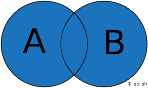

# Veille SGBD

## Système de gestion de base de données

Un système de gestion de base de données (SGBD) est le logiciel qui permet à un ordinateur de stocker, récupérer, ajouter, supprimer et modifier des données. Un SGBD gère tous les aspects primaires d'une base de données, y compris la gestion de la manipulation des données, comme l'authentification des utilisateurs, ainsi que l'insertion ou l'extraction des données.
en garantissant la qualité, la pérennité et la confidentialité des informations, tout en cachant la complexité des opérations. [1]

Un SGBD définit ce qu'on appelle le schéma de données ou la structure dans laquelle les données sont stockées.

Les outils que nous utilisons tous au quotidien nécessitent des SGBD en coulisse. Cela comprend les guichets automatiques bancaires, les systèmes de réservation de vols, les systèmes d'inventaire au détail et les catalogues de bibliothèques, par exemple. [2]

- **Qu'est-ce qu'une base de données relationnelle ?**

    Une base de données relationnelle est une base de données qui forme des relations entre des tables qui stockent des données sur des entités spécifiques. Une base de données relationnelle utilise SQL, langage de requête structuré.

- **Qu'est-ce qu'une base de données non relationnelle ?**

    Les bases de données NoSQL sont plus flexibles car les données sur l'objet ne sont pas limitées à la même table. Les bases de données non relationnelles utilisent des colonnes et des lignes pour saisir des types de données et leurs valeurs et identifier les objets avec des clés. [6]

### Forces des SGBD relationnels

* Modèle simple

* Précision des données

* Accès facile aux données

* Intégrité des données

* Flexibilité

* Normalisation

* Sécurité

* Les bases de données relationnelles sont faciles à modifier [6]

Les bases de données relationnelles permettent d’avoir des données claires et claires. Des problèmes surviennent lorsque toutes les données de l’exemple précédent ne sont contenues que dans une seule table, contrairement à une base de données relationnelle. Étant donné que chaque élève a plusieurs années d’études, leurs coordonnées seraient entrées plusieurs fois en même temps que chaque année d’études. Cela n’est pas nécessaire et peut créer de la confusion lors de la recherche dans la base de données. En les séparant, comme dans une base de données relationnelle, les informations de contact n’ont besoin d’être saisies qu’une seule fois. [7]

### Faiblesses des SGBD relationnels

* Les problèmes de performance
* Pas de prise en charge des types de données complexes
* La configuration prend beaucoup de temps au cours des étapes initiales. [6]

Le principal problème lors de l’utilisation d’une base de données relationnelle est la complexité qui apparaît lors de sa création. Il est absolument vital que les relations définies entre les tables soient correctes et que chaque ensemble d’informations soit lié à sa paire. Bien qu’il y ait moins d’informations à saisir au total qu’avec d’autres bases de données, s’assurer que chaque point est correctement configuré est un processus lent. De plus, les relations peuvent devenir extrêmement complexes lorsqu’une base de données relationnelle contient plus de deux tables. [7]

### Propriétés ACID [9]

Les propriétés ACID sont quatre propriétés essentielles d'un sous-système de traitement de transactions d'un système de gestion de base de données. Le mot **ACID** est un acronyme référant aux propriétés suivantes :

- **Atomicité** : une transaction doit soit être complètement validée ou complètement annulée.
- **Cohérence** : aucune transaction ne peut sortir de la base de données dans un état incohérent.
- **Isolation** : une transaction ne peut voir aucune autre transaction en cours d'exécution.
- **Durabilité** : après que le client ait été informé du succès de la transaction, les résultats de celle-ci ne disparaîtront pas.

------------------------------------

## Les spécificités des systèmes NoSQL [10] [12] 

Une différence essentielle entre les bases de données NoSQL et les bases de données relationnelles traditionnelles réside dans le fait que NoSQL est une forme de stockage non structuré.

Cela signifie que NoSQL n'a pas de structure de table fixe comme celle trouvée dans les bases de données relationnelles. [10]

Les bases de données NoSQL organisent les gros volumes de données au moyen de techniques flexibles, tels que des documents, graphiques, paires de valeurs et colonnes. En ce sens, les systèmes NoSQL sont parfaitement adaptés aux applications exigeant le traitement de larges volumes de données sur la base de structures flexibles. Dans la mesure où les systèmes NoSQL exploitent un cluster matériel et un serveur Cloud, les capacités sont réparties de manière uniforme et la base de données fonctionne avec fluidité, même en cas de volumes de données élevés. Contrairement aux bases de données relationnelles qui perdent rapidement de la puissance à mesure que le volume de données augmente, les bases de données NoSQL s’imposent comme une solution performante, flexible et évolutive pour le stockage de grosses quantités de données.

L'une des particularités des systèmes NoSQL est, en outre, leur capacité de dimensionnement horizontal. Les bases de données SQL relationnelles sont dimensionnées verticalement. Leur entière performance repose sur un seul et même serveur. Pour augmenter leur capacité, il faut investir dans un serveur plus puissant, ce qui, sur la durée est non seulement plus cher, mais limite également les possibilités de développement d'application. Les solutions NoSQL répartissent généralement leurs données sur plusieurs serveurs. En cas d’augmentation du volume de données, de nouveaux serveurs peuvent alors facilement être ajoutés. Les bases de données NoSQL peuvent ainsi enregistrer et traiter sans problème de gros volumes de données. Elles sont donc particulièrement adaptées aux applications pour le Big Data. [12]

-------------------------------

## Les spécificités des systèmes NewSQL [13]

NewSQL est une catégorie de SGBD relationnelle moderne qui cherche à fournir :
- La même puissance évolutive (c'est à dire le faite de s'adapter à un changement d'ordre de grandeur, par exemple une forte demande) que le système NoSQL pour les applications concernant les traitement transactionnel en ligne ( type d'application qui sert a modifier des informations en temps réel, par exemple des applications bancaire)
- maintient les propriété ACID d'un système de gestion de base de donnée traditionnel (atomicité, cohérence, isolation et durabilité).
- Elle tire aussi partie des évolutions du matériel et des nouvelle architectures distribuées.

NewSQL est tiré du monde NoSQL mais reste différent. Comme NoSQL elle tire partie des architectures distribuées, des progrès du matériel lors de ces dernières années. Mais contrairement à NoSQL elle permet de conserver le modèle relationnel au coeur du système.

Le NewSQL est une architecture qui reprend donc les avantages du NoSQL et comble son principal désavantage. Il palie à l'éventuel cohérence des données de ce dernier grâce au support de transaction ACID via un langage pour les requêtes le SQL. Ci-dessous quelques-unes de ces caractéristiques:

- Le SQL comme langage commun de requétage
- Transaction ACID
- Un mécanisme qui évite la pause de verrous lors d'opérations concurrentes de lecture avec les opérations d'écritures. La lecture en temps réel en est ainsi facilitée.
- Une architecture qui a de meilleures performances par nœud que les solutions classiques de type SGBDR.
- Architecture distribuée
- la plupart utilise des base de données en mémoire

------------------------------------

## Commandes SQL [14] [15]

### Tri des données

*ORDER BY* : cette commande permet de trier les lignes dans un résultat d’une requête SQL. Il est possible de trier les données sur une ou plusieurs colonnes, par ordre ascendant ou descendant.

#### Syntaxe

``SELECT colonne1, colonne2, colonne3
FROM table
ORDER BY colonne1 DESC, colonne2 ASC``

.

### Renommage
*AS* : permet de renommer le nom d'une colonne dans les résultats d'une requête SQL. C'est pratique pour avoir un nom facilement identifiable dans une application qui doit ensuite exploiter les résultats d'une recherche.

#### Syntaxe
``
SELECT colonne1 AS c1, colonne2
FROM `table` ``

.

### Agrégation
*GROUP BY* : Cette commande est utilisée en SQL pour grouper plusieurs résultats et utiliser une fonction de totaux sur un groupe de résultat. Sur une table qui contient toutes les ventes d’un magasin, il est par exemple possible de liste regrouper les ventes par clients identiques et d’obtenir le coût total des achats pour chaque client.

#### Syntaxe
``
SELECT colonne1, fonction(colonne2)
FROM table
GROUP BY colonne1
``

.

### Jointures

- **INNER JOIN** : jointure interne pour retourner les enregistrements quand la condition est vrai dans les 2 tables. C'est l'une des jointures les plus communes.

- **RIGHT JOIN** : jointure croisée permettant de faire le produit cartésien de 2 tables. En d'autres mots, permet de joindre chaque lignes d'une table avec chaque lignes d’une seconde table. Attention, le nombre de résultats est en général très élevé.

- **LEFT JOIN** : jointure externe pour retourner tous les enregistrements de la table de gauche (LEFT = gauche) même si la condition n'est pas vérifié dans l'autre table.

- **FULL JOIN** : jointure externe pour retourner tous les enregistrements de la table de droite (RIGHT = droite) même si la condition n'est pas vérifié dans l'autre table.

- **SELF JOIN** : permet d’effectuer une jointure d’une table avec elle-même comme si c'était une autre table.

- **NATURAL JOIN** : jointure naturelle entre 2 tables s'il y a au moins une colonne qui porte le même nom entre les 2 tables SQL.

- **UNION JOIN** : jointure d'union.

#### Syntaxe

``SELECT *
FROM A
INNER JOIN B ON A.key = B.key``

.

### Opérations

Les opérations résultant des regroupements, c'est à dire très généralement toute expression de filtre devant introduire un calcul d'agrégation.

Les opérateurs ensemblistes :

- *L'UNION*

    Commande **UNION** : permet de mettre bout-à-bout les résultats de plusieurs requêtes utilisant elles-même la commande *SELECT*. C'est donc une commande qui permet de concaténer les résultats de 2 requêtes ou plus.

    **Syntaxe:**

    ``
    SELECT * FROM table1
    UNION
    SELECT * FROM table2
    ``

- *L'INTERSECTION*

    Commande **INTERSECT** : permet d’obtenir l'intersection des résultats de 2 requêtes. Cette commande permet donc de récupérer les enregistrements communs à 2 requêtes. Cela peut s'avérer utile lorsqu’il faut trouver s'il y a des données similaires sur 2 tables distinctes.

    **Syntaxe:**
    
    ``
    SELECT * FROM `table1`
    INTERSECT
    SELECT * FROM `table2`
    ``

- *LA DIFFÉRENCE*

    Commande **EXCEPT/MINUS** : s'utilise entre 2 instructions pour récupérer les enregistrements de la première instruction sans inclure les résultats de la seconde requête. 

    **Syntaxe:**

    ``
    SELECT * FROM table1
    EXCEPT
    SELECT * FROM table2
    ``

------------------------------------

## Le système d'information [16]

Le système d'information ou SI, peut être défini comme étant l'ensemble des moyens humains, matériels et immatériels mis en œuvre afin de gérer l'information au sein d'une unité, une entreprise par exemple.

Il ne faut toutefois pas confondre un système d'information avec un système informatique. En effet, les systèmes d'information ne sont pas toujours totalement informatisés et existaient déjà avant l'arrivée des nouvelles technologies de l'information et des communications dont l'informatique fait partie intégrante.

Le SI possède quatre fonctions essentielles :

- la saisie ou collecte de l'information ;
- la mémorisation de l'information à l'aide de fichier ou de base de données ;
- le traitement de l'information afin de mieux l'exploiter (consultation, organisation, mise à jour, calculs pour obtenir de nouvelles données…) ;
- la diffusion de l'information.

Autrefois, l'information était stockée sur papier à l'aide de formulaires, de dossiers… et il existait des procédures manuelles pour la traiter. Aujourd'hui, les systèmes informatisés, comme les systèmes de gestion de bases de données relationnelles (SGBDR), sont mis au service du système d'information.

## Merise [16]

MERISE est une méthode française née dans les années 70, développée initialement par Hubert Tardieu. Elle fut ensuite mise en avant dans les années 80, à la demande du ministère de l'Industrie qui souhaitait une méthode de conception des SI.

MERISE est donc une méthode d'analyse et de conception des SI basée sur le principe de la séparation des données et des traitements. Elle possède un certain nombre de modèles (ou schémas) qui sont répartis sur trois niveaux :

* le niveau conceptuel ;
* le niveau logique ou organisationnel ;
* le niveau physique.

### Modèle conceptuel de données (MCD)

Il s'agit de l'élaboration du modèle conceptuel des données (MCD) qui est une représentation graphique et structurée des informations mémorisées par un SI. Le MCD est basé sur deux notions principales : les entités et les associations, d'où sa seconde appellation : le schéma Entité/Association.

L'élaboration du MCD passe par les étapes suivantes :

* la mise en place de règles de gestion (si celles-ci ne vous sont pas données) ;
* l'élaboration du dictionnaire des données ;
* la recherche des dépendances fonctionnelles entre ces données ;
* l'élaboration du MCD (création des entités puis des associations puis ajout des cardinalités).

## Modélisation Merise de la base de données Netflix

### Commentaire modélisation

La représentation ci-dessus est une tentative de modélisation Merise de la base de données Netflix. Cette modélisation ne représente pas la réalité de la BDD Netflix, mais plutôt un "idéal" où il existerait une relation entre les deux tables netflix_shows et netflix_titles (ici *identifier*). De plus, il n'existe pas de *clé étrangère* permettant de garantir l'intégrité référentielle entre les deux tables de la BDD. 
Par ailleurs, les données de la BDD ont été séparées en deux tables peuvant être contenues dans une seule et unique table. Ceci rend la représentation encore plus incohérente.

Je pense que la modélisation demandée n'a d'utilité que d'apprendre la méthode Merise et se l'approprier.

------------------------------------

# Bibliographie

* [1] : **Système de gestion de base de données** (https://fr.wikipedia.org/wiki/Syst%C3%A8me_de_gestion_de_base_de_donn%C3%A9es).
* [2] : **L'essentiel à savoir un système de base de données** (https://www.oracle.com/fr/database/systeme-gestion-base-de-donnees-sgbd-definition.html).
* [3] : **Base de données relationnelle** (https://fr.wikipedia.org/wiki/Base_de_donn%C3%A9es_relationnelle).
* [4] : **Introduction aux SGBD relationnels** (https://cours.ebsi.umontreal.ca/sci6306/co/introduction_relationnel.html).
* [5] : **Quel SGBD relationnel correspond le mieux à vos besoins ?** (https://www.lemagit.fr/conseil/Quel-SGBD-relationnel-correspond-le-mieux-a-votre-environnement).
* [6] : **Differences Between Relational and Non-Relational Database** (https://jelvix.com/blog/relational-vs-non-relational-database).
* [7] : **Base de données relationnelle : Avantages et désavantages** (http://www.lavise.fr/fiches/43945.html)
* [8] : **ACID : les 4 propriétés des transactions de bases de données** (https://www.lebigdata.fr/acid-base-de-donnees-definition)
* [9] : **Propriétés ACID - Définition et Explications** (https://www.techno-science.net/definition/333.html)
* [10] : **Bases de données NoSQL : Le guide définitif** (https://pandorafms.com/blog/fr/bases-de-donnees-nosql/)
* [11] : **Database decisions for the internet of things** (https://www.dbbest.com/blog/database-decisions/)
* [12] : **NoSQL : la tendance au stockage structuré de données** (https://www.ionos.fr/digitalguide/hebergement/aspects-techniques/nosql/)
* [13] : **NewSQL** : (https://air.imag.fr/index.php/NewSQL)
* [14] : **Cours et tutoriels sur le langage SQL** (https://sql.sh/)
* [15] : **Tutorial SQL** (http://www.w3big.com/fr/sql/default.html)
* [16] : **Initiation à la conception de bases de données relationnelles avec MERISE** (https://ineumann.developpez.com/tutoriels/merise/initiation-merise/)
